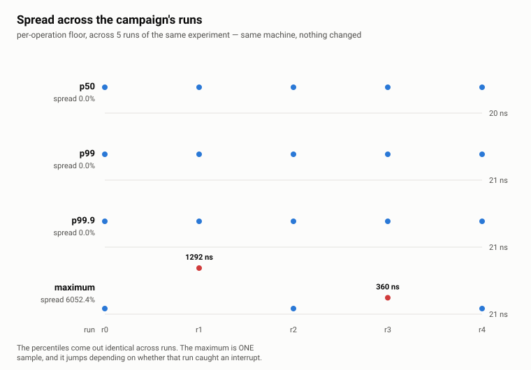

> [🇧🇷 Português](README.md) | 🇺🇸 English

# 08.01 — The harness measuring itself

**State: measured.** There is a published number, with a generated environment
and a program that produces it, archived under
[`bench/medicoes/`](bench/medicoes/historico/2026-09-22-piso-do-harness/).

## Objectives

Measure the instrument's cost before any structure topic uses it, and establish
the latency below which per-operation measurement stops describing the
operation.

## Problem

The module's question is *how does the harness avoid measuring itself*. The
answer is that it does not: it measures its own cost, publishes that number, and
only then can attribute the rest to the operation under test. What is avoided is
measuring itself **without knowing**.

This matters because the standard publishes latency by high percentiles, and a
percentile requires one sample per operation. Every sample carries two clock
reads, and an operation costing less than that pair is not distinguishable from
it.

## Mental model

There are two ways to measure, and the choice between them is not a matter of
taste:

| Mode | How | What it gives, and what it takes |
|---|---|---|
| batch | one pair of reads for *N* operations | the clock's cost dilutes; the distribution disappears — there is no p99 of an average |
| per operation | one pair of reads per operation | the tail shows up; the instrument's floor enters every sample |

The track needs the second, because it publishes p99 and p99.9. This topic
exists so that its price is measured beforehand.

## How it works

Three arms, in one program and one harness:

1. **reading the clock** — the amortized cost of one `now_ns()` call, measured
   in batch over the rounds;
2. **recording a sample** — what the tail collector charges per recorded sample;
3. **per-operation floor** — the interval between two consecutive reads, with
   **nothing** in between. It is the smallest latency this harness can observe
   per operation.

The third is what closes the argument.

## Implementation

The tail uses no histogram. The track's origin document planned
`HdrHistogram_c`, and the decision changed after two checks: it is not in
WrapDB, and its log writer pulls in zlib, against the promise of no dependency
beyond the compiler. More importantly, the problem HDR solves — an unbounded
stream of samples in constant space — is not the problem of a laboratory that
chooses how many operations it will measure.

So the samples are kept: a preallocated buffer of `uint64_t`, and the percentile
comes out **exact**, with no precision to declare because there is no loss to
declare. What is paid is memory proportional to the sample count and one final
sort, both outside the hot path. See
[`lib/measurement/tail.hpp`](../../../lib/measurement/tail.hpp).

`record()` must not allocate, which is why the capacity is reserved once: a
vector growth in the middle of the measurement would land in the next sample,
and the harness would start measuring its own growth while attributing it to the
operation.

## Experiment

A campaign of **5** runs of the whole program, in `release`, with **25** samples
per batch arm, **200000** rounds per sample and **10000** samples in the tail
arm — which is the minimum that supports p99.9 under this project's convention.

```bash
./scripts/build-all.sh release
./scripts/arquivar-medicao.sh piso-do-harness 5
```

## Execution environment

Generated, not described: [`ambiente.md`](bench/medicoes/historico/2026-09-22-piso-do-harness/ambiente.md)
and the same content inside
[`metadata.json`](bench/medicoes/historico/2026-09-22-piso-do-harness/metadata.json).

What weighs most on the numbers below: an AMD Ryzen 9 9900X, SMT on, two L3
domains, `governor=powersave` with boost on, and a `steady_clock` resolution of
**1** ns.

## Results

| Metric | Median across runs | Spread across runs | Unit |
|---|---:|---:|---|
| reading the clock (median) | 16.09 | 4.6% | ns |
| reading the clock (minimum) | 16.06 | 0.1% | ns |
| recording a sample (median) | 0.12 | 0.3% | ns |
| per-operation floor p50 | 20.00 | 0.0% | ns |
| per-operation floor p99 | 21.00 | 0.0% | ns |
| per-operation floor p99.9 | 21.00 | 0.0% | ns |
| per-operation floor maximum | 21.00 | 10681.0% | ns |


<picture>
  <source media="(prefers-color-scheme: dark)" srcset="imagens/dispersao-piso-escuro.en.svg">
  
</picture>

The figure is the argument: three straight lines and one jagged. The maximum's
**10681%** spread does not measure the instrument — it measures **which runs
caught an interrupt**.

## What this measurement does not show

- **what the benchmark removed:** there is no work between the two reads, no
  cache pressure, no other thread competing. A floor measured under real load is
  higher, and this number is the best case;
- **which arm that favours:** none — there are no two arms here. But it does
  favour the impression that per-operation measurement is cheaper than it will be
  inside a structure topic;
- **what conclusion a reader would draw stopping at the table:** that
  per-operation measurement costs 20 ns. It costs at least that, on this
  machine, with no load;
- **what would be needed** for the broader conclusion: repeating the floor
  inside every topic that uses per-operation measurement, and publishing both
  side by side.

## When it goes wrong

Three failure paths, and all three have a check that fires.

**The measured loop disappears.** At `-O2` the recording arm measured 0.359 ns;
in `release` it started measuring 0.000 — and zero is not *fast*, it is *did not
happen*: with nobody observing the collector's state, the optimizer removed the
whole loop. The ruler treats a zero median as `below_resolution`, a legitimate
state for an operation faster than the clock, which is why the table looked
plausible. The fix is to observe the state after the loop.

**The validity gate does not cover the mode that archives.** The program's first
version checked validity **after** the `--csv` mode's `return`. The text mode
failed; `--csv`, which is exactly what the campaign archives, exited zero. A
campaign was versioned with full provenance describing an arm that did not
measure. It was discarded, and the program now checks before any output. Today
the control arm (`--control-arm`) forces the case and the L2 test requires
rejection in **both** modes.

**Publishing a percentile the sample does not support.** A p99.9 of 1000 samples
rests on one observation, which is the maximum under another name.
`tail_statistics` carries the highest supported percentile, the program warns
when the tail is short, and the suite has a case that aborts when publication is
requested without support.

## Analysis

The per-operation floor is **20** ns at the median, and p50, p99 and p99.9 come
out **identical across the five runs** — a 0.0% spread on all three. The pair of
reads costs roughly what a single read costs in batch, which is consistent with
the cost being in the call itself rather than in what it measures.

The **maximum** is the exception, and an instructive one. The per-run series is
`[2264, 21, 21, 21, 1864]`: two of the five runs caught an interrupt and the
other three did not. The **10681%** spread does not describe variation of the
instrument — it describes **how many isolated samples each run collected**. The
maximum is one sample, and publishing it without the series beside it invites
the wrong conclusion. It stays in the table because hiding the extent of what was
observed is worse than showing it, but it sustains no comparison at all.

### An earlier reading of this topic was refuted by more measurement

The first archived campaign showed p99 varying by **42.9%** across runs, and the
clock arm about 26% more expensive on `r0` and `r1`. We concluded there that the
campaign had a **warm-up**: the machine taking two seconds to settle at boost
frequency.

This campaign refutes that. The clock's spread fell to 4.6% and sits on `r3`, not
on the first runs; the percentiles did not vary at all. What there was is
**sporadic interference**, hitting runs at random — not a warm-up transient,
which would always hit the first ones.

The correct conclusion is more modest and more useful: on this machine the
instrument's **typical value is reproducible**, and what varies across runs is
how much interference each one collected. The spread across runs remains a
mandatory field — but it measures the **state of the machine during the
campaign**, not a stable property of it. Two campaigns of the same measurement
gave 42.9% and 0.0% on the same p99.

The cost of recording a sample, **0.12** ns, is on the order of one instruction:
the collector is not what limits per-operation measurement. The clock is.

## Literature comparison

The order of magnitude matches what is documented about `clock_gettime` on Linux
x86-64 with `vDSO`: tens of nanoseconds, with no kernel entry. The microbenchmark
literature recommends batch measurement precisely because of this floor, and the
recommendation is consistent with what was measured here — what this topic adds
is not the recommendation, it is this machine's number, so that later topics can
subtract it or avoid it with a criterion.

What was **not** found in the literature consulted was any treatment of the
spread across runs of a high percentile as publishable data. It is recorded as an
open question: the common practice is to publish the best run, and that hides
precisely what the table above shows.

## Trade-offs

| Choice | Gain | Price |
|---|---|---|
| raw samples instead of a histogram | exact percentile, zero dependency | memory proportional to the samples, one final sort |
| per-operation measurement | the tail shows up | the instrument's floor in every sample |
| batch measurement | the floor dilutes | there is no percentile of an average |

## When to use

Per-operation measurement when the operation under test costs well above the
floor — as a rule of thumb on this machine, above a few hundred nanoseconds —
and whenever the conclusion depends on the tail.

## When not to use

When the operation costs less than the floor. The way out is not a smaller
number: it is measuring in batch and dropping the claim to publish a percentile
for that arm, saying so in the document.

## Limitations

One machine, one compiler per campaign, no core isolation and no pinned
governor. The floor was measured with no concurrent load. None of these numbers
holds as a property of `steady_clock` in general: they hold as a property of this
machine, and that is what they are for.

## Exercises

1. Run the campaign with `governor=performance` and compare the spread across
   runs of p99. How much of it was the governor?
2. Pin the process to a core in each L3 domain and redo the floor. Does the CCD
   change the floor, or only the tail?
3. Reduce the tail to 500 samples and check that the unsupported-percentile
   warning appears. Then remove the warning from the program and see which test
   turns red.

## References

- [Project standard](../../padrao-do-projeto.en.md), sections 11, 28, 29 and 35
- [`lib/measurement/tail.hpp`](../../../lib/measurement/tail.hpp)
- [`lib/measurement/clock.hpp`](../../../lib/measurement/clock.hpp)
- [Reference catalogue](../../referencias.en.md)

## Navigation

- [Track](../../../ROADMAP.en.md)
- [Repository README](../../../README.en.md)

> [🇧🇷 Português](README.md) | 🇺🇸 English
